## Using the AccelRR8 Framework to Grow Value Exponentially

The AccelRR8 Framework shown below right is an actionable tool that helps enterprising leaders use proven accelerators to generate exponentially better products, services, financials, and inspiration.  

We imagine the AccelRR8 Framework as an engine shown below left which leaders can use to rocket to their aspirations. A rocket applies a force to its payload while it burns, accelerating its velocity faster and faster, and lifting it exponentially higher and higher off the ground.

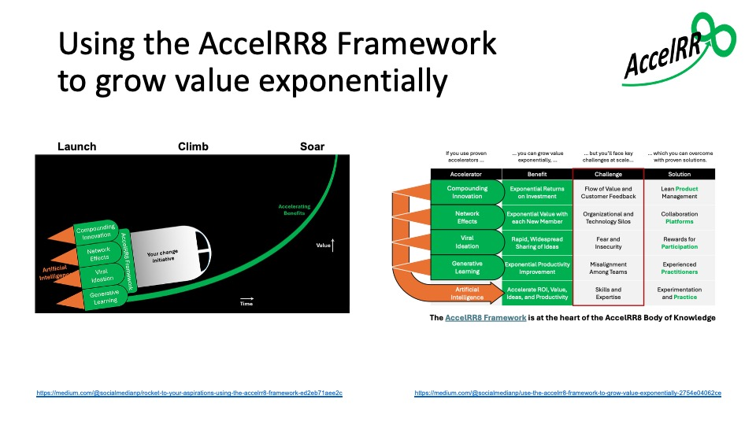

### Using value growth accelerators to grow value exponentially

Thus far, our research has isolated five proven value growth accelerators described in the two graphics below; we’ll incorporate others (if any) as we identify them.

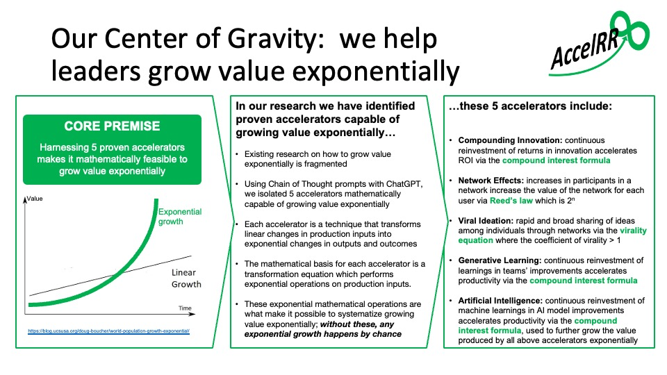

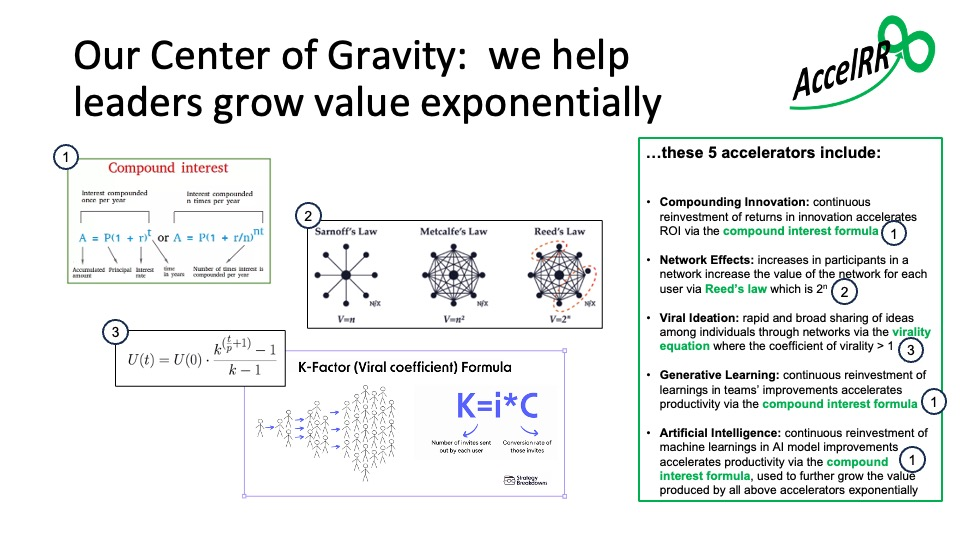

These value growth accelerators are factored together with other value growth drivers, and their mathematical product determines the rate of exponential value growth over time.  This rate, or value growth factor, is the base of the resulting exponential equation as shown below.

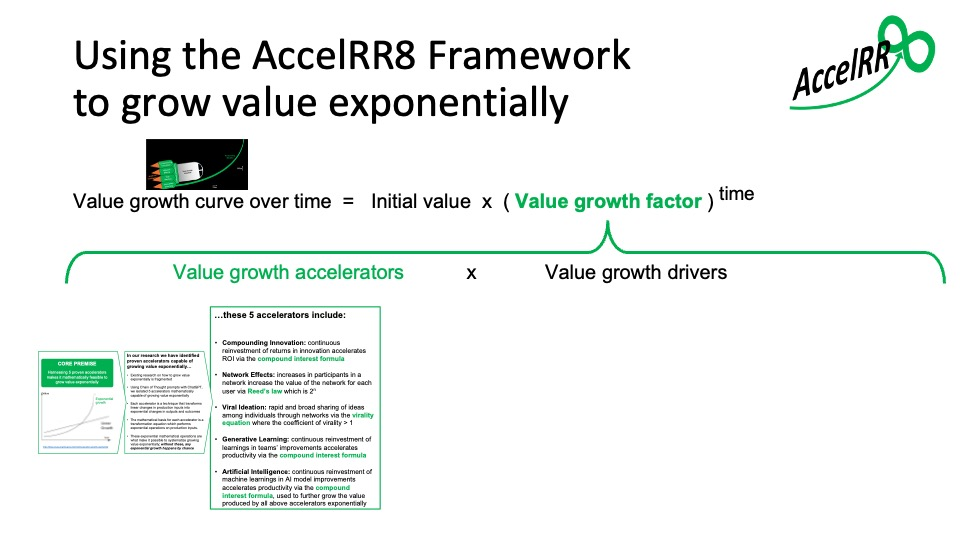

### Using value growth accelerators to grow VALUATION exponentially

Businesses often achieve *Valuation Growth* that can be modeled using a Compounding Annual Growth Rate (CAGR), which is an approximation representing an exponential *Valuation growth curve over time* using a compound-interest-like formula as shown in the graphic below.

- Various traditional *Valuation Growth Drivers* contribute to this valuation growth.

- Businesses can also accelerate valuation growth using one or more *Valuation Growth Accelerators*.  

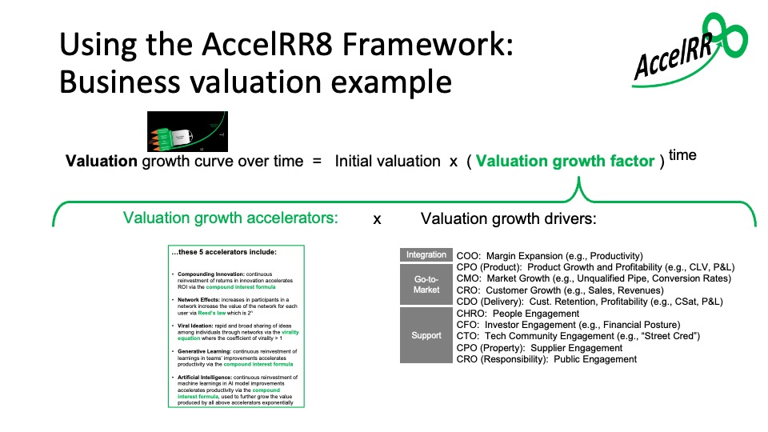

The graphic below simply rearranges the above graphic, showing the valuation growth accelerators as the mathematical product of each accelerator.

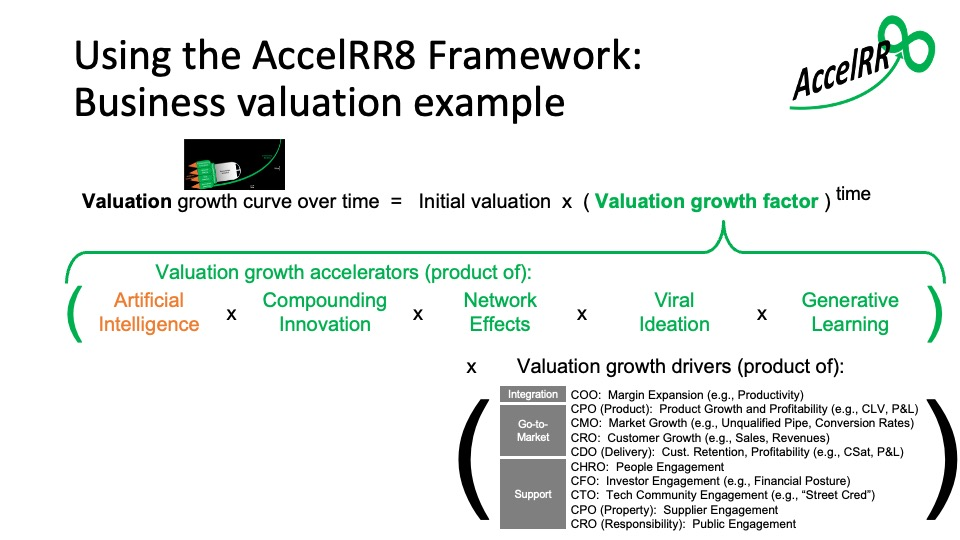

### Systematically using value growth accelerators over time

The benefits of each Value Growth Accelerator multiply when they are used together.

Each Value Growth Accelerator can accelerate growth continuously throughout the change initiative’s journey.

To keep the change initiative’s rocket accelerating throughout its flight, each accelerator packed into the rocket has "boosters" that must be activated at each stage of the rocket’s flight.

One such booster is in each cell of the table shown in the below graphic, where each column represents a Value Growth Accelerator, and each row represents a stage of the rocket's flight. 

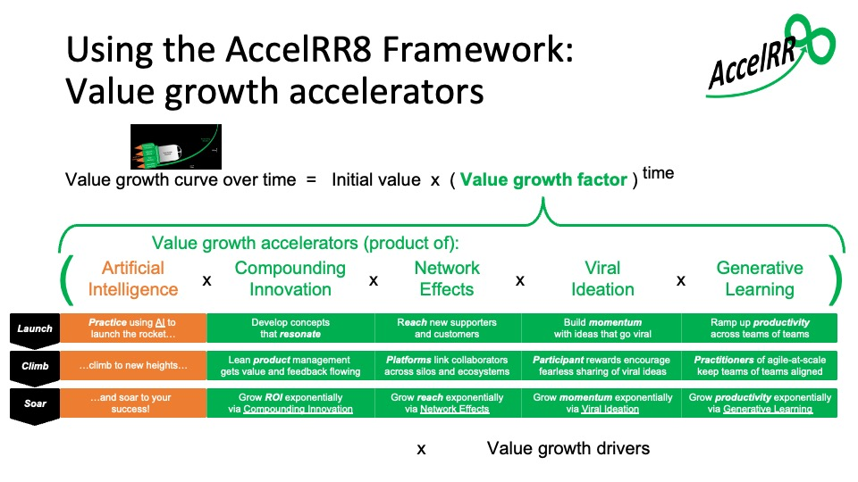

We find the below graphic is an easier way to visualize the stages of the rocket’s flight and the boosters that must be activated at each stage.

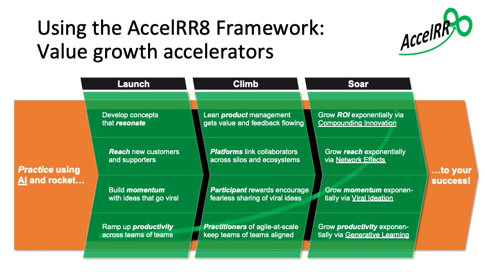

### Using the AccelRR8 Framework to grow value exponentially

Look again at the AccelRR8 Framework below in comparison to the above graphic.

In the first column are the accelerators packed into the AccelRR8 Framework rocket.  Each has the potential to deliver the exponential benefits (2nd column) shown throughout the rocket’s journey. 

On the right in grey are the challenges (3rd column) leaders face when their change initiative (payload strapped to the AccelRR8 Framework rocket) Climbs toward achieving exponential benefits at scale. 

At this Climb/Scale stage, using the proven Solutions shown to the right (4th column) will activate the boosters in each accelerator, propelling the rocket past the challenges and soaring to success.

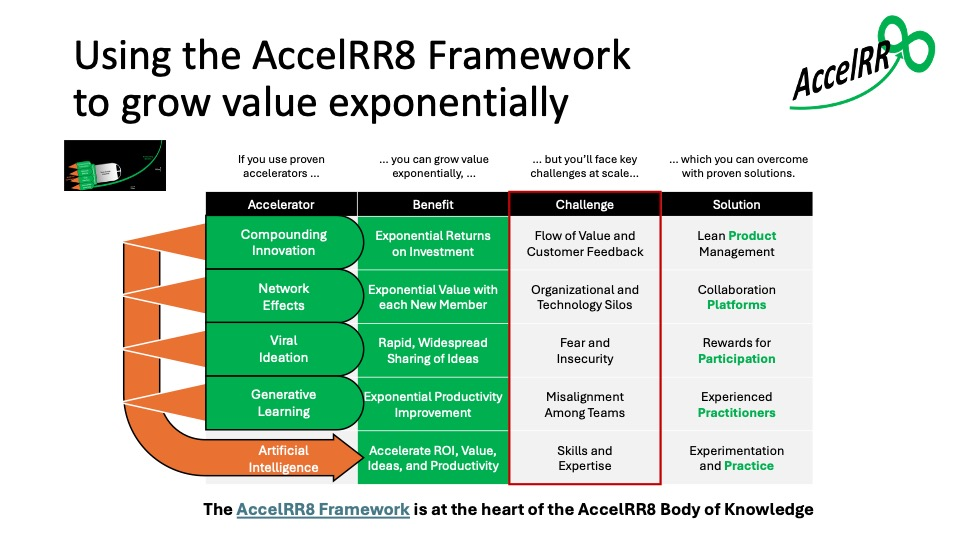

In the below graphic we show how to use the AccelRR8 Framework to launch and grow a change initiative’s value exponentially as it climbs toward achieving exponential benefits at scale.

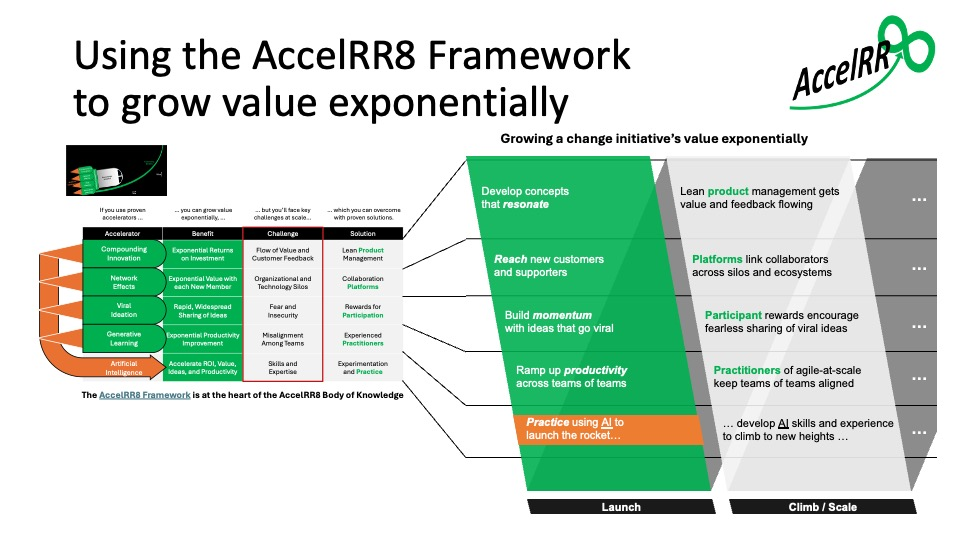

In the below graphic we show in greater detail how to use the AccelRR8 Framework as above.

Specific leading indicators of success are shown in both Launch and Climb / Scale stages.

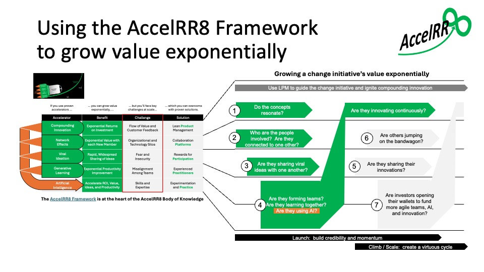

